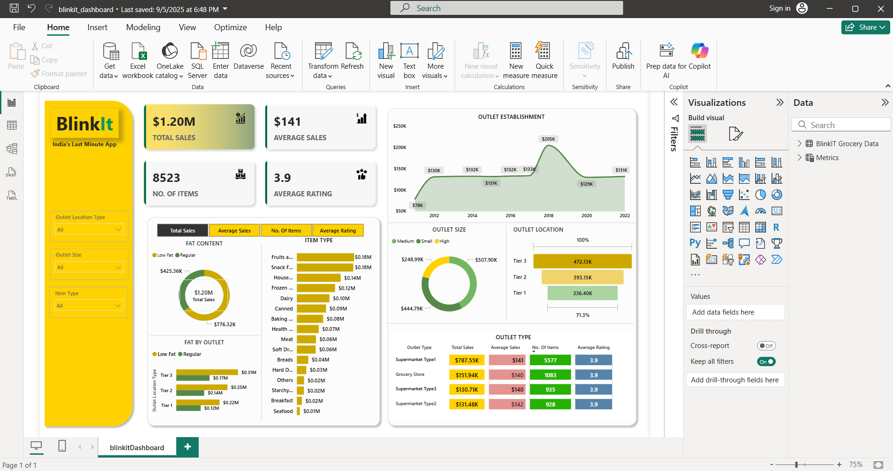
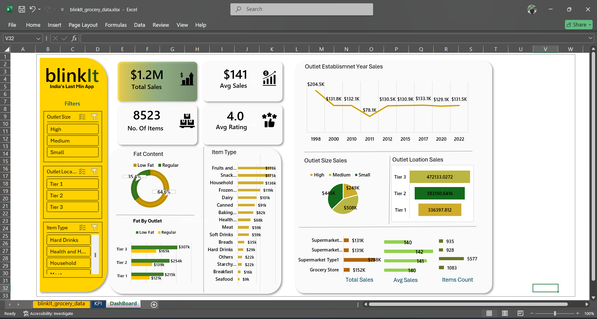
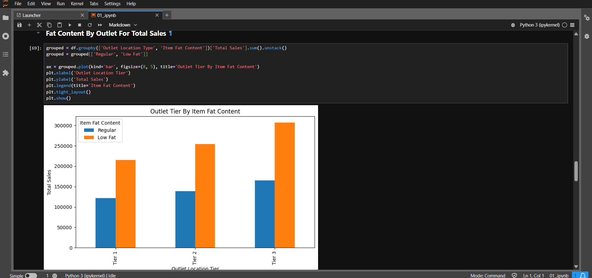
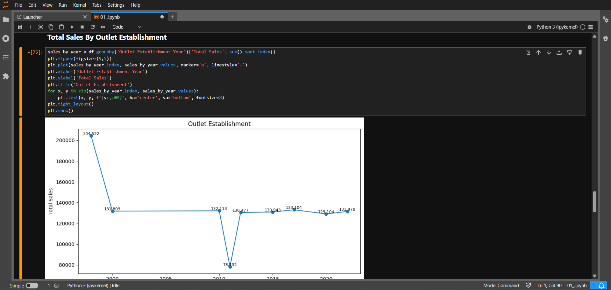
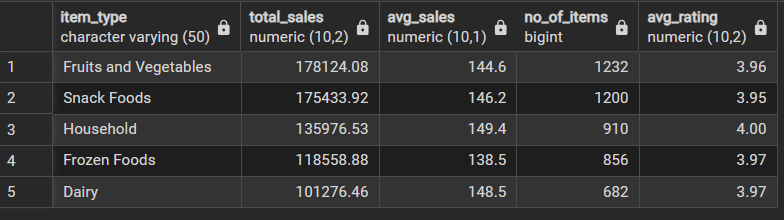
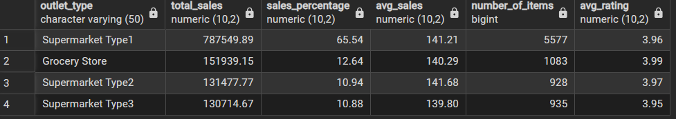

# 📊 Blinkit Sales Analysis – Capstone Project 2025

This project analyzes **Blinkit sales data** to uncover business insights such as top-selling products, seasonal trends, and revenue drivers.  
It was built as an **end-to-end data analytics project** using **SQL, Python, Excel, and Power BI**.

---

## 🔹 Project Objective
To analyze Blinkit’s sales and customer data, clean and transform it, and build interactive dashboards that help in:
- Identifying top-selling products and categories
- Understanding seasonal sales trends
- Analyzing revenue contribution by products
- Supporting decision-making for business growth

---

## 🔹 Tools & Technologies
- **SQL** → Data extraction, cleaning, and transformations  
- **Python** → Exploratory Data Analysis (EDA) and visualization  
- **Excel** → Pivot tables & static dashboard  
- **Power BI** → Interactive business dashboard  

---

## 🔹 Project Workflow
1. **Data Cleaning & Preparation**
   - Removed duplicates, handled missing values
   - Standardized categories and product names  

2. **SQL Analysis**
   - Performed aggregations (SUM, COUNT, AVG)
   - Used `GROUP BY`, `ORDER BY`, and window functions for trends
   - Generated KPIs like total sales, top products, and yearly growth  

3. **Python EDA**
   - Jupyter Notebook for data exploration  
   - Visualizations: sales trends, product distribution, top item   

4. **Excel Dashboard**
   - Pivot tables for sales summary  
   - Charts showing product performance and sales by month  

5. **Power BI Dashboard**
   - Interactive dashboard with filters  
   - KPIs: Revenue, orders, items  
   - Drilldowns for category- and product-level analysis  

---

## 🔹 Key Insights
- 📈 **Top 20% of products drive 70% of revenue** (Pareto Principle)  
- 🕒 **Seasonal trends**: Sales peak during festive months  
- 💰 **Beverages & Snacks** are the highest revenue-generating categories  
- 👥 **Repeat customers** contribute significantly to overall revenue  

---

## 🔹 Dashboard Preview
### Power BI Dashboard  


---

### Excel Dashboard  


---
### Python Charts
### Fat Content Sales By Outlet Location  


### Total Sales By Establishment Year


---

### SQL Analysis  

### Total Sales By Item Type  


### Sales By Outlet Size  


---

## 🔹 How to Use This Project
1. Clone the repository:  
   ```bash
   git clone https://github.com/your-username/Blinkit-Analysis-Capstone-2025.git
